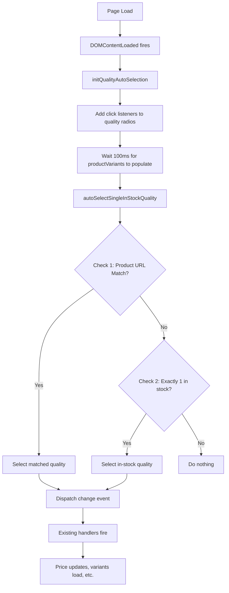

# Auto-Select Quality Feature

## Overview

The Auto-Select Quality feature automatically selects the appropriate quality option (Aftermarket, CAPA, or OEM) on product detail pages based on either the product being viewed or inventory availability. This streamlines the user experience by reducing the number of selections required when the choice is obvious.

**Feature Branch:** `feature/us-auto-select-single-instock-quality`

---

## Business Logic

### Primary Selection Logic (Priority Order)

#### 1. Product URL Detection (Highest Priority)

When a user clicks on a specific quality product from the collection listing:

- **Aftermarket product** → Auto-select Aftermarket radio
- **CAPA product** → Auto-select CAPA radio
- **OEM product** → Auto-select OEM radio

#### 2. Single In-Stock Detection (Fallback)

When exactly one quality has available inventory:

- Count all qualities with `hasExtraInventory = true` or `variantInventory > 0`
- If count equals exactly 1 → Auto-select that quality
- If count is 0 or 2+ → No auto-selection (user must choose)

### User Selection Protection

The system respects explicit user choices:

- ✅ Once user clicks any quality radio, auto-selection is disabled
- ✅ `userSelectedQuality` flag prevents future auto-selections
- ⚠️ **Exception:** If user's selection becomes unavailable AND exactly one other quality is available, the system may auto-switch

---

## Technical Architecture

### Files Modified

#### 1. `assets/product-page-component-library.js`

**Lines:** ~183-340

Added core auto-selection functions:

```javascript
// Track if user has manually selected a quality
let userSelectedQuality = false;

// Get list of qualities with inventory
function getInStockQualities() {
	/* ... */
}

// Perform auto-selection based on URL and/or inventory
function autoSelectSingleInStockQuality() {
	/* ... */
}

// Set up click tracking to detect user selections
function initQualityAutoSelection() {
	/* ... */
}

// Re-evaluate after state changes
function reevaluateQualityAutoSelection() {
	/* ... */
}
```

#### 2. `snippets/quality-options-radio-btns.liquid`

**Lines:** ~439-443

Integration point on page load:

```javascript
document.addEventListener("DOMContentLoaded", async function () {
	// ... existing code ...

	// Initialize quality auto-selection tracking
	if (typeof initQualityAutoSelection === "function") {
		initQualityAutoSelection();
	}

	// Attempt auto-selection after 100ms delay
	setTimeout(() => {
		if (typeof autoSelectSingleInStockQuality === "function") {
			autoSelectSingleInStockQuality();
		}
	}, 100);
});
```

---

## Execution Flow

### On Page Load



### Product Detection Algorithm

```javascript
// Step 1: Extract current product info
const currentProductHandle = window.location.pathname.split("/").pop();
const currentProductId = window.currentProductId;

// Step 2: Check each quality (stops at first match)
for (let qualityType of ["aftermarket", "capa", "oem"]) {
	const qualityVariants = window.productVariants[qualityType];

	// Check multiple conditions (priority order):
	if (currentProductId === qualityVariants[0].id) {
		return qualityType; // ✓ Variant ID match (most reliable)
	} else if (currentProductHandle === productHandle) {
		return qualityType; // ✓ Exact handle match
	} else if (productTitle.includes(` ${qualityType} `)) {
		return qualityType; // ✓ Quality keyword in title (with spaces)
	}
}
```

### Inventory Detection Algorithm

```javascript
function getInStockQualities() {
	const inStock = [];

	["aftermarket", "capa", "oem"].forEach((qualityType) => {
		const hasStock = productVariants[qualityType].some((variant) => {
			return (
				variant.hasExtraInventory === true ||
				(variant.extraInventory && parseInt(variant.extraInventory) > 0) ||
				(variant.variantInventory && parseInt(variant.variantInventory) > 0)
			);
		});

		if (hasStock) inStock.push(qualityType);
	});

	return inStock; // e.g., ['capa'] or ['aftermarket', 'capa']
}
```

---

## Data Dependencies

### `window.productVariants` Structure

Populated by `snippets/product-page-paint-options.liquid` at line ~1196:

```javascript
{
  aftermarket: [
    {
      id: "40123456789",
      title: "Unpainted +$0.00",
      variantSku: "HY1000188",
      variantInventory: "15",
      extraInventory: 15,
      baseInventory: 0,
      hasExtraInventory: true,
      productTitle: "2012 Hyundai Accent GLS Front Bumper - HY1000188",
      productHandle: "2012-hyundai-accent-gls-front-bumper-hy1000188"
    },
    // ... more variants
  ],
  capa: [ /* same structure */ ],
  oem: [ /* same structure */ ]
}
```

### Quality Radio Button Structure

```html
<input
	type="radio"
	name="quality_type"
	value="aftermarket"
	data-quality-sku="HY1000188"
	data-price="$104.99"
	data-available="true"
/>
```

**Rendered by:** `snippets/quality-options-radio-btns.liquid`  
**Selector:** `input[name="quality_type"][value="aftermarket"]`

---

## Debug Console Logs

All logs are prefixed with `[Auto-Select]` for easy filtering.

### Success Example

```
[Auto-Select] Checking productVariants: {aftermarket: Array(12), capa: Array(11), oem: Array(11)}
[Auto-Select] Current product handle: hy1000188c ID: 8807949641301
[Auto-Select] aftermarket check: {productTitle: "2012 Hyundai Accent GLS Front Bumper...", variantId: "40123456789"}
[Auto-Select] ✓ Match found via variant ID: aftermarket
[Auto-Select] Final selection from product detection: aftermarket
[Auto-Select] ✓ Auto-selecting based on product URL: aftermarket
```

### Inventory-Based Example

```
[Auto-Select] aftermarket: hasStock=false, variants count=12
[Auto-Select] capa: hasStock=true, variants count=11
[Auto-Select] oem: hasStock=false, variants count=11
[Auto-Select] No quality detected from product URL/ID
[Auto-Select] In-stock qualities: ['capa']
[Auto-Select] ✓ Auto-selecting quality based on inventory: capa
```

### No Auto-Selection Example

```
[Auto-Select] In-stock qualities: ['aftermarket', 'capa']
[Auto-Select] Skipped: Found 2 qualities in stock (need exactly 1)
```

---

## Testing Scenarios

### Test Case 1: Product URL Detection

| Scenario | User Action                       | Expected Result           |
| -------- | --------------------------------- | ------------------------- |
| 1A       | Click Aftermarket from collection | Aftermarket auto-selected |
| 1B       | Click CAPA from collection        | CAPA auto-selected        |
| 1C       | Click OEM from collection         | OEM auto-selected         |

### Test Case 2: Inventory-Based Selection

| Scenario | Stock Status                | Expected Result               |
| -------- | --------------------------- | ----------------------------- |
| 2A       | Only CAPA in stock          | CAPA auto-selected            |
| 2B       | Aftermarket + CAPA in stock | No auto-select (user chooses) |
| 2C       | All out of stock            | No auto-select                |

### Test Case 3: User Override Protection

| Scenario | Steps                                      | Expected Result      |
| -------- | ------------------------------------------ | -------------------- |
| 3A       | Auto-select CAPA → User clicks Aftermarket | Stays on Aftermarket |
| 3B       | User selects quality → Change paint option | Quality unchanged    |

---

## Performance Metrics

- **Execution Time:** Less than 50ms for auto-select logic
- **Memory Impact:** ~1KB for function definitions
- **Event Listeners:** +1 click listener per quality radio (typically 3)
- **Page Load Delay:** 100ms setTimeout for productVariants population

---

## Browser Compatibility

| Browser       | Version | Status       |
| ------------- | ------- | ------------ |
| Chrome        | 90+     | ✅ Supported |
| Edge          | 90+     | ✅ Supported |
| Firefox       | 88+     | ✅ Supported |
| Safari        | 14+     | ✅ Supported |
| iOS Safari    | 14+     | ✅ Supported |
| Chrome Mobile | 90+     | ✅ Supported |

**ES Features Used:**

- Arrow functions (ES6)
- Template literals (ES6)
- `querySelector` (ES5)
- `Array.some()` (ES5)
- `dispatchEvent()` (DOM Level 2)

---

## Troubleshooting

### Issue: No Auto-Selection Occurs

**Symptoms:** Quality radios remain unselected on page load

**Debug Steps:**

1. Open Console (F12) and look for `[Auto-Select]` logs
2. Check if `window.productVariants` is populated:
   ```javascript
   console.log(window.productVariants);
   ```
3. Verify quality radios exist and aren't disabled:
   ```javascript
   document.querySelectorAll('input[name="quality_type"]');
   ```
4. Check timing - increase delay in `quality-options-radio-btns.liquid` if needed

**Common Causes:**

- `productVariants` not loaded yet (increase 100ms delay)
- Quality radios disabled (check fitment selection required)
- All qualities have same stock status (2+ or 0 in stock)

### Issue: Wrong Quality Selected

**Symptoms:** OEM selected when CAPA product was clicked

**Debug Steps:**

1. Check console for product detection logs
2. Look for multiple matches:
   ```
   [Auto-Select] ✓ Match found: capa
   [Auto-Select] ✓ Match found: oem  // ← Problem!
   ```
3. Verify product titles have distinct quality keywords

**Solution:** Code now uses `for` loop with early break to stop at first match

### Issue: Auto-Select Overrides User Choice

**Symptoms:** User selects quality, then it switches automatically

**Debug Steps:**

1. Check `userSelectedQuality` flag:
   ```javascript
   console.log("User Selected Quality:", userSelectedQuality);
   ```
2. Look for unexpected calls to `reevaluateQualityAutoSelection()`
3. Check if click listener is properly attached

**Solution:** Verify `initQualityAutoSelection()` is called on page load

---

## Future Enhancements

### Potential Improvements

#### 1. Analytics Integration

```javascript
// Track auto-selection events
gtag("event", "quality_auto_selected", {
	quality: qualityToSelect,
	method: "url", // or 'inventory'
	product_handle: currentProductHandle,
});
```

#### 2. User Preference Persistence

```javascript
// Remember last selected quality
localStorage.setItem("preferredQuality", selectedQuality);

// Use on next visit as default (if available)
const preferredQuality = localStorage.getItem("preferredQuality");
```

#### 3. Multi-Language Support

```javascript
const qualityKeywords = {
	aftermarket: {
		en: "aftermarket",
		es: "postmercado",
	},
	capa: {
		en: "capa",
		es: "certificado capa",
	},
};
```

#### 4. A/B Testing Framework

```javascript
if (experiment.variant === "auto-select") {
	autoSelectSingleInStockQuality();
	trackExperimentMetric("auto_select_enabled");
}
```

---

## Integration Points

### Existing Features Affected

✅ **Paint Options Selection**

- Auto-selected quality triggers paint variant dropdown population
- Price displays update correctly

✅ **VIN Decoder**

- VIN input field visibility depends on quality (OEM requires VIN)
- Auto-selection properly shows/hides VIN fields

✅ **Delivery Countdown**

- ETAs calculated for auto-selected quality
- Updates correctly when user changes selection

✅ **Add to Cart**

- Correct product added based on auto-selected quality
- Cart reflects proper SKU and pricing

---

## Rollback Plan

### Quick Disable (No Deploy)

Add to browser console or tag manager:

```javascript
window.autoSelectSingleInStockQuality = () => false;
window.initQualityAutoSelection = () => {};
```

### Code Rollback

1. Revert commit:

   ```bash
   git revert <commit-hash>
   ```

2. Or manually remove:

   - Lines ~183-340 from `product-page-component-library.js`
   - Lines ~439-443 from `quality-options-radio-btns.liquid`

3. Deploy changes

---

## Code Review Checklist

- [ ] Console logs are helpful and prefixed with `[Auto-Select]`
- [ ] No infinite loops (early returns in place)
- [ ] User selection flag properly set on click
- [ ] For loop breaks after first match (no overwriting)
- [ ] 100ms delay sufficient for productVariants load
- [ ] Works with disabled quality radios (graceful skip)
- [ ] No errors when quality UI doesn't exist
- [ ] Event bubbling works (change event fires correctly)
- [ ] Integration with existing quality handlers intact
- [ ] Browser compatibility verified (IE11 not required)

---

## Related Documentation

- [VIN Decoder Input Box](./vin-decoder.md)
- [Add to Cart Quality Re-enable](./add-to-cart-quality-reenable.md)
- [Product Variants Data Structure](../../partify-theme/snippets/product-page-paint-options.liquid)

---

## Support

**Feature Owner:** Senior Shopify Theme Engineer  
**Feature Branch:** `feature/us-auto-select-single-instock-quality`  
**Last Updated:** January 2, 2026  
**Version:** 1.0
